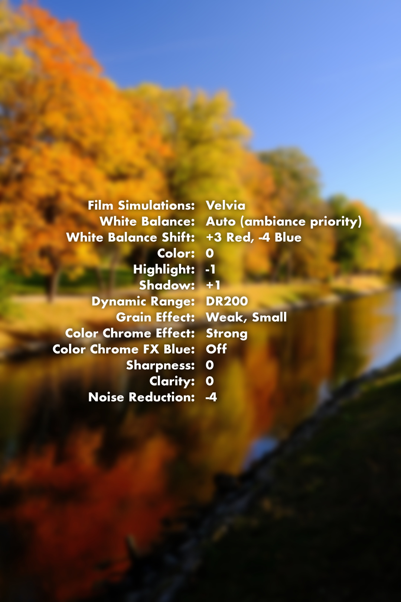
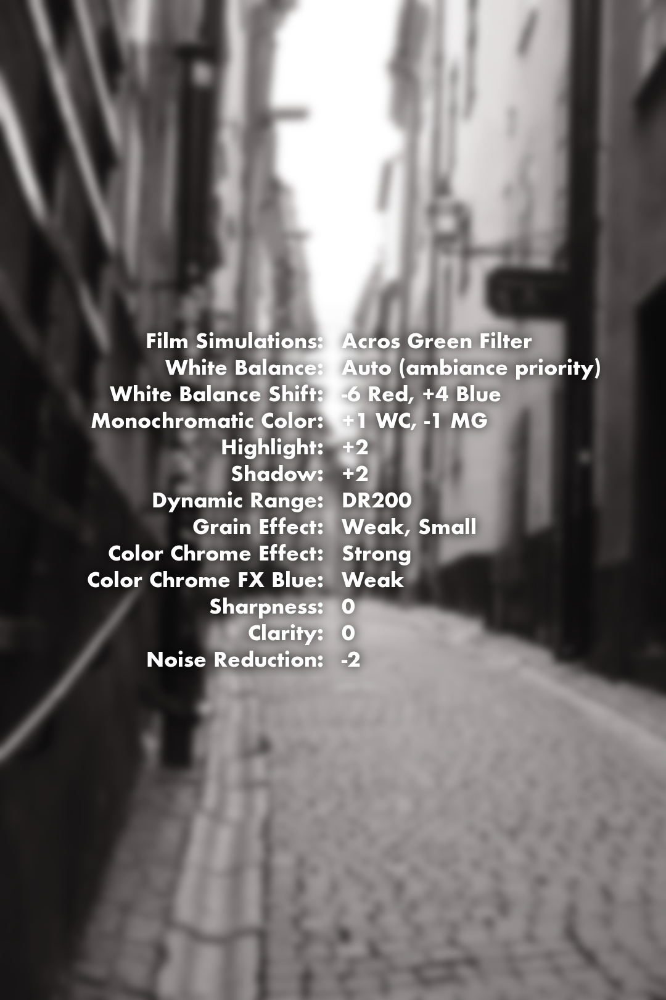

# Fujifilm Recipe Tools


<!--toc:start-->

- [Fujifilm Recipe Tools](#fujifilm-recipe-tools)
  - [Scripts](#scripts)
    - [`fujifilm-recipe-card.sh`](#fujifilm-recipe-cardsh)
    - [`fujifilm-recipe-inspector.sh`](#fujifilm-recipe-inspectorsh)
  - [Dependencies](#dependencies)
    - [macOS (Homebrew)](#macos-homebrew)
    - [Linux (Debian/Ubuntu)](#linux-debianubuntu)
  - [Installation & Setup](#installation-and-setup)
    - [Global Access (Symlinking)](#global-access-symlinking)
  - [Usage](#usage)
    - [Fuji-card](#fuji-card)
      - [Image example output](#image-example-output)
    - [Fuji-inspect](#fuji-inspect)
      - [Inspect example output](#inspect-example-output)

    <!--toc:end-->

Two Bash scripts for extracting and inspecting Fujifilm film simulation recipe
data from `.RAF` and `.JPG` files.

> [!WARNING]
> These scripts have currently only been tested with images from a Fujifilm X-M5.

## Scripts

### `fujifilm-recipe-card.sh`

Extracts recipe parameters and generates a new JPEG with the settings overlaid
on the original image.

**Output:** `<filename>-recipe.jpg` (1080px wide, blurred background, text overlay).

### `fujifilm-recipe-inspector.sh`

Reads EXIF data and outputs a formatted ASCII table of the recipe settings
directly in the terminal.

## Dependencies

Ensure the following are installed and available in your `$PATH`.

### macOS (Homebrew)

```bash
brew install exiftool imagemagick
```

### Linux (Debian/Ubuntu)

```bash
sudo apt-get install libimage-exiftool-perl imagemagick
```

> [!NOTE]
> `imagemagick` is only required for the card generator script.\_

## Installation and Setup

1. Clone the repository.
2. Make the scripts executable:

```bash
chmod +x fujifilm-recipe-card.sh fujifilm-recipe-inspector.sh
```

### Global Access (Symlinking)

To run these scripts from any directory, create symbolic links to a directory in
your `$PATH` (e.g., `/usr/local/bin` or `~/.local/bin`).

```bash
# Example: Link to /usr/local/bin (requires sudo)
sudo ln -s "$(pwd)/fujifilm-recipe-card.sh" /usr/local/bin/fuji-card
sudo ln -s "$(pwd)/fujifilm-recipe-inspector.sh" /usr/local/bin/fuji-inspect
```

You can now run them using `fuji-card` or `fuji-inspect`.

## Usage

### Fuji-card

**Generate a visual recipe card:**

```bash
./fujifilm-recipe-card.sh DSCF1001.JPG
```

or with the symlink

```bash
fuji-card DSCF1001.JPG
```

#### Image example output

<!-- markdownlint-disable MD033 -->
<table>
  <thead>
    <tr>
      <th>Original Image</th>
      <th>Recipe Image</th>
    </tr>
  </thead>
  <tbody>
    <tr>
      <td>
        
      </td>
      <td>
        
      </td>
    </tr>
    <tr>
      <td>
        
      </td>
      <td>
        
      </td>
    </tr>
  </tbody>
</table>
<!-- markdownlint-enable MD033 -->

### Fuji-inspect

```bash
./fujifilm-recipe-inspector.sh DSCF1001.JPG
```

or with the symlink

```bash
fuji-inspect DSCF1001.JPG
```

#### Inspect example output


